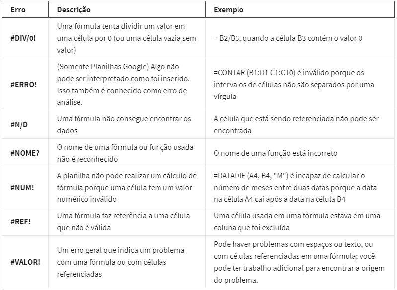

# Resolução de problemas

> **Pensamento estruturado:** processo de reconhecimento do problema atual ou situação, organizando as informações disponíveis, revelando lacunas e oportunidades e identificando as opções

--------------------------------------------------------------

### Do problema à ação: As seis fases da análise de dados
 
#### Etapa 1: Perguntar  
É impossível resolver um problema se você não sabe o que é. Você deve considerar os seguintes aspectos:  

- Defina o problema que você está tentando resolver.
- Certifique-se que você entendeu totalmente as expectativas das partes interessadas.
- Concentre-se no problema real e evite distrações
- Colabore com as partes interessadas e mantenha uma linha de comunicação aberta
- Reflita sobre todo o contexto da situação  

**Perguntas que devem ser feitas nesta etapa:**
- Quais questões as partes interessadas dizem ser da minha alçada?
- Agora que identifiquei essas questões, como posso ajudar as partes interessadas a resolver suas dúvidas?  

#### Etapa 2: Preparar  
Você decidirá quais dados você precisa coletar para responder às suas perguntas e como organizá-los para que sejam úteis. Você pode usar sua tarefa de negócios para decidir: 

- Quais métricas medir
- Localizar os dados em seu banco de dados
- Criar medidas de segurança para proteger esses dados  

**Perguntas que devem ser feitas nesta etapa:**
- O que preciso descobrir como resolver este problema?
- Que pesquisa eu preciso fazer?  

#### Etapa 3: Processar  
Dados limpos são os melhores dados e você precisará limpá-los para se livrar de quaisquer erros, imprecisões ou possíveis inconsistências. Isso pode significar:

- Usar funções de planilha para encontrar dados que foram inseridos incorretamente
- Usar funções SQL para verificar se há espaços extras
- Remover dados duplicados
- Verificar o máximo possível a parcialidade dos dados  

**Perguntas que devem ser feitas nesta etapa: **
- Quais erros de dados ou imprecisões podem me atrapalhar na obtenção da melhor resposta possível para o problema que estou tentando resolver?
- Como posso limpar meus dados para que as informações que tenho sejam mais consistentes?

#### Etapa 4: Analisar 
Você deve pensar analiticamente sobre seus dados. Nesta fase, você pode classificar e formatar seus dados para tornar mais fácil: 

- Realizar cálculos
- Combine dados de diferentes fontes
- Criar tabelas com seus resultados
  
**Perguntas que devem ser feitas nesta etapa:**
- Que história meus dados estão me contando?
- Como meus dados me ajudarão a resolver esse problema?
- Quem precisa do produto ou serviço da minha empresa? Que tipo de pessoa tem maior probabilidade de usá-lo?

#### Etapa 5: Compartilhar  
Todos compartilham seus resultados de maneira diferente, portanto, certifique-se de resumir seus resultados com efeitos visuais claros e atraentes de sua análise usando ferramentas de visualização de dados, como gráficos ou painéis. Esta é a sua chance de mostrar as parte interessadas que você resolveu o problema deles e como chegou lá. Compartilhar certamente ajudará sua equipe a: 

- Tomar melhores decisões
- Tomar decisões com mais base
- Levar a resultados mais efetivos
- Comunicar suas descobertas com sucesso
  
**Perguntas que devem ser feitas nesta etapa:**
- Como posso tornar o que apresentei para as partes interessadas envolvente e fácil de entender?
- O que me ajudaria a entender isso se eu fosse o ouvinte?

#### Etapa 6: Agir
Agora é hora de agir de acordo com seus dados. Você pegará tudo o que aprendeu com a análise de dados e colocará em uso. Isso pode significar fornecer às partes interessadas recomendações com base em suas descobertas, para que possam tomar decisões baseadas em dados.
  
**Perguntas que devem ser feitas nesta etapa:**
- Como posso usar o feedback que recebi durante a fase de compartilhamento (etapa 5) para realmente atender às necessidades e expectativas das partes interessadas?
  
Essas seis etapas podem ajudá-lo a quebrar o processo de análise de dados em partes menores e gerenciáveis, o que é chamado de pensamento estruturado. Este processo envolve quatro atividades básicas:

- Reconhecer o problema ou situação atual
- Organizar as informações disponíveis 
- Revelar lacunas e oportunidades
- Identificar suas opções

------------------------------------------------------------------------------

### Tipos de problemas 

- Fazer previsões:  
Usar dados para tomar uma decisão consciente sobre como as coisas podem ser no futuro  
  
- Categorizar coisas:  
Atribuir informações para diferentes grupos ou clusters com base em recursos em comuns  

- Identificar algo fora do normal:  
O analista de dados identifica os dados que são diferentes do padrão  

- Identificar temas:  
Leva a categorização um passo adiante,a grupando as informações em conceitos mais amplos  

- Descobrir conexões:  
Permite que o analista de dados encontre desafios semelhantes enfrentados por diferentes entidades, e então combine os dados e insights para abordá-los  

- Encontrar padrões:  
Os analistas usam dados para encontrar padrões usando históricos, a fim de entender o que aconteceu no passado e, portanto, o que provavelmente acontecerá novamente

------------------------------------------------------------------------------

### Perguntas SMART

- Pergunta dirigida: te leva a responder de uma certa maneira
- Pergunta fechada: pode ser respondida com sim ou não, raramente leva a percepções valiosas
- Questões vagas e sem contexto: sem saber o que responder  

**SMART**

**S**pecific - específicas     
> simples, significativas e focadas em um único tópico ou algumas ideias intimamente relacionadas  

**M**easurable - mensuráveis 
> podem ser quantificadas e avaliadas

**A**ction-oriented - orientadas para ação  
> incentivam mudanças  

**R**elevant - relevante  
> questões que importam e têm significado para o problema que você está tentando resolver  

**T**ime-bound - prazo determinado  
> especificam o limite de tempo

------------------------------------------------------------------------------------------

> Tomada de decisão inspirada em dados: Explora diferentes fontes de dados para identificar o que há em comum.

### Tipos de dados  

**Quantitativo:** medidas específicas e objetivas de fatos numéricos.
- Que? Quantos? e Quantas vezes?

**Qualitativos:** medidas subejtivas e explicativas de qualidades e características, ou de coisas que não podem ser medidas com dados numéricos.
- Por quê?

------------------------------------------------------------------------------------------

### Visualizar e compartilhar  

**Relatórios (Reports):** coleção estática de dados fornecida periodicamente ás partes interessadas.  
- Dados instantÂneos
- Rápidos de projetar
- Não são dinâmicos ou automáticos

**Painéis (Dashboards):** monitora dados recebidos em tempo real  
- Mais pessoas tem acesso
- Dinâmcio, automático e interativo
- Levam bastante tempo para serem projetados

> Tabela dinâmica (Pivot table): É uma ferramenta de resumo de dados, usada no processamento de dados

------------------------------------------------------------------------------------------  

- Métricas: tipo quantificável e isolado de dados que pode ser usado na avaliação.

- Meta de métrica: meta mensurável definida por uma empresa e é avaliada com o uso de métricas

-------------------------------------------------------------------------------------------

### Lógica Matemática

Analisar um problema e em um passo de cada vez, segmentá-lo em partes menores.

Small Data: 
- Métricas específicas
- Periodo curto de tempo
- Decisões do cotidiano

Big Data:
- Conjunto de dados maiores e menos específicos
- Maior período
- Questões de garnde escala e grandes decisões

-------------------------------------------------------------------------------------------

### Planilhas 

Erros

**Função:** comando predefinido que executa automaticamente um processo ou tarefa específica usando os dados.

> “Se eu tivesse uma hora para salvar o planeta, gastaria 59 minutos definindo o problema e um minuto resolvendo-o” Albert Einstein

**Domínio do problema:** Problem Domain: área específica de análise que abrange todas as atividades que afetam ou são afetadas pelo problema.

-------------------------------------------------------------------------------------------

### Pensamento Estruturado

**Escopo de trabalho:** Scope of Work (SOW) é um esboço combinado do trabalho que você vai realizar em um projeto. como analista de dados, seu escopo de trabalho será um pouco mais técnico, coisas como preparação de dados, validação, análise de conjuntos de dados quantitativos e qualitativos, resultados iniciais, e talvez até mesmo alguns recursos visuais para realmente transmitir o ponto.

> Uma declaração de trabalho é um documento que identifica claramente os produtos e serviços que um fornecedor ou contratado fornecerá a uma organização. Inclui objetivos, diretrizes, resultados, cronograma e custos.
>
>Um escopo de trabalho é baseado em projeto e define as expectativas e limites de um projeto. Um escopo de trabalho pode ser incluído em uma declaração de trabalho para ajudar a definir os resultados do projeto.

-------------------------------------------------------------------------------------------

Contexto é importante na análise de dados porque ajuda a filtrar grandes quantidades de dados desorganizados e transformá-los em algo significativo. Na verdade, os dados têm pouco valor se não estiverem emparelhados com o contexto.

------------------------------------------------------------------------------

### Comunicação com a equipe

Importante garantir que seu trabalho esteja alinhado às necessidades delas e é por isso que você precisa se comunicar efetivamente com todas as partes interessadas (Stakeholders) em toda a sua equipe.

- Pensar em quem você quer comunicar e quando.

**Público Alvo**
Responda sempre estas quatro perguntas importantes sobre o público-alvo:

- Quem é seu público-alvo?
- O que o seu público-alvo já sabe?
- O que o seu público-alvo precisa saber?
- Qual é a melhor forma de comunicar o que o seu público-alvo precisa saber?