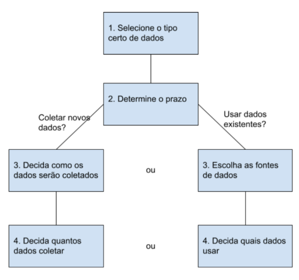

# Exploração de dados

### Coleta de dados

> Como são coletados?
> - Entrevistas;
> - Observações;
> - Formulários;
> - Questionários;
> - Pesquisas;
> - Cookies.

**Considerações para coleta de dados**:

- Como os dados vão ser coletados;
- Escolher fontes de dados;
- Decidir quais dados vão ser utilizados;
- Quantos dados vão ser coletados;
- Selecionar o tipo de dados certo;
- Prazo para a coleta de dados.

> **Dados primários**: dados coletados por um indivíduo ou grupo usando seus próprios recursos.  
> **Dados secundários**: coletados por um grupo diretamente de seu público e vendidos posteriormente.
> **Dados terceiros**: dados fornecidos de fontes externas que não os coletaram diretamente.
> **Population**: todos os valores de dados possíveis em um determinado conjunto de dados.  
> **Amostra**: parte de uma população de dados.

#### Diferentes formatos e estrutura de dados

**Dados qualitativos** não pode ser contado, medido ou facilmente expressado usando números. Normalmente listados como um nome, categoria ou descrição.

**Dados quantitativos:** podem ser medidos, contados e expressos como um número. Dados com certa quantidade, tanto ou intervalo.

**Dados discretos**: dados que são contados e tem um número limitado de valores.

**Dados contínuos**: podem ser medidos usando um temporizador e seus valores podem ser exibidos como um decimal com várias casas.

**Dados nominais**: tipo de dados qualitativos que são categorizados sem uma ordem definida.

**Dados ordinais**: tipos de dados qualitativos com uma ordem ou escala definida.

**Dados internos**: dados que residem os próprios sistemas de uma empresa.

**Dados externos**: dados que são gerados fora de uma organização.

**Dados estruturados**: dados organizados em um determinado formato, como linhas e colunas ou banco de dados relacionais e planilhas.  
> Modelos de dados: modelo usado para organização de elementos dados e como eles se relacionam uns com os outros.  
> Elementos de dados: são informações como nomes de pessoas, endereços.

**Dados não estruturados**: não estão organizados em qualquer forma facilmente identificável, como audio, videos, midias sociais, emails e fotos.

#### Tipos de dados

Os tipos podem ser diferentes dependendo de qual consulta você está fazendo, por exemplo planilhas, os dados podem ser: text ou string, boolean e numbers

**Dados amplos**: cada sujeito tem uma única linha com várias colunas para manter os valores

**Dados longos**: cada linha é um ponto no tempo por assunto, então cada assunto terá dados em várias linhas

# Garantindo a integridade dos dados

# Tudo sobre banco de dados

